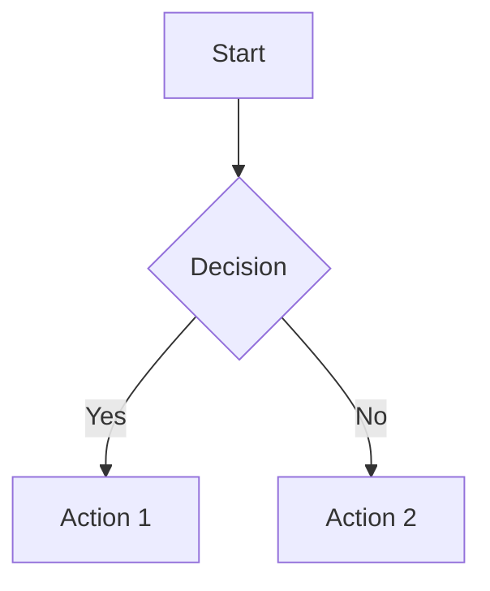

# Markdown Studio

[](https://deepwiki.com/theoklitosBam7/markdown-studio)

A beautiful, modern Markdown editor with live preview, Mermaid diagram support, and a clean writing experience. Available as both a web app and a desktop application.

## What is Markdown Studio?

Markdown Studio is a split-pane Markdown editor that lets you write on one side and see the rendered result instantly on the other. It supports the full CommonMark specification plus Mermaid diagrams for flowcharts, sequence diagrams, entity relationships, Gantt charts, and more.

**Key highlights:**

- Clean, distraction-free writing environment
- Real-time preview as you type
- Built-in diagram support via Mermaid
- Dark and light themes
- File management (open, save, save as)
- Example templates to get you started
- Available as a web app or desktop application

## Features

### For Writers

- **Split-pane editor** — Write on the left, preview on the right
- **Live Markdown rendering** — See changes instantly as you type
- **Mermaid diagram support** — Create flowcharts, sequence diagrams, ER diagrams, and Gantt charts using simple text syntax
- **Theme switching** — Toggle between light and dark modes
- **Word and character count** — Track your document stats in real-time
- **Example documents** — Load pre-made templates to learn Markdown or Mermaid syntax
- **Copy to clipboard** — Quickly copy your Markdown source

### For Developers

- **Safe HTML rendering** — Content is sanitized with DOMPurify
- **File operations** — Open, save, and manage `.md` files (desktop app)
- **Responsive design** — Works on desktop and mobile devices
- **Keyboard shortcuts** — Efficient editing with familiar shortcuts

## Getting Started

### Web App

Visit the app in your browser (after running the dev server):

```sh
pnpm install
pnpm dev
```

### Desktop App

Build and run the Electron desktop application:

```sh
# Install dependencies
pnpm install

# Run in development mode
pnpm dev:desktop

# Build for production
pnpm build:desktop

# Create macOS distribution package (unsigned, no auto-publish)
pnpm dist:mac
```

> [!IMPORTANT]
> **⚠️ macOS Security Warning — Action Required**
>
> If macOS says `Markdown Studio.app` is **damaged and can't be opened**, you need to clear the quarantine flag after moving it to `/Applications`:
>
> ```sh
> xattr -cr /Applications/Markdown\ Studio.app
> ```
>
> **Alternative:** Open `System Settings` → `Privacy & Security` and allow the app to run from there.

## Usage

### Writing Markdown

Simply start typing in the editor pane. The preview pane updates automatically as you write.

### Creating Diagrams

Use Mermaid syntax within fenced code blocks:

````markdown

````

Supported diagram types include:

- Flowcharts
- Sequence diagrams
- Entity relationship diagrams
- Gantt charts
- And more

### Switching Themes

Click the theme toggle button in the toolbar to switch between light and dark modes. The transition includes a smooth animation effect.

### Loading Examples

Click the "Examples" button in the toolbar to browse and load pre-made documents demonstrating various Markdown and Mermaid features.

### File Operations (Desktop)

When running the desktop app:

- **Open** — Load existing `.md` files
- **Save** — Save your current document
- **Save As** — Save with a new name or location
- **New Document** — Start fresh with an empty editor

## Development

### Project Structure

```
src/
├── features/markdown/
│   ├── components/        # UI components (EditorPane, PreviewPane, Toolbar, etc.)
│   └── composables/       # Business logic (useMarkdownEditor, useDocumentSession)
├── composables/           # Shared composables (useTheme, useDesktop)
├── utils/                 # Utility functions
├── views/                 # Page-level components
├── router/                # Vue Router configuration
├── App.vue               # Root component
└── main.ts               # Application entry point

electron/                  # Electron main process code
```

### Tech Stack

- **Vue 3** — Progressive JavaScript framework with Composition API
- **Vite** — Fast build tool and dev server
- **TypeScript** — Type-safe development
- **Pinia** — State management
- **Vue Router** — Client-side routing
- **Marked** — Markdown parser and compiler
- **DOMPurify** — HTML sanitization
- **Mermaid** — Diagram generation from text
- **Electron** — Cross-platform desktop app framework
- **electron-vite** — Vite integration for Electron
- **electron-builder** — Packaging and distribution

### Available Scripts

```sh
# Development
pnpm dev              # Start Vite dev server
pnpm dev:desktop      # Start Electron in dev mode

# Building
pnpm build            # Build for production
pnpm build:desktop    # Build Electron bundles
pnpm dist:mac         # Create unsigned macOS package

# Preview
pnpm preview          # Preview production build
pnpm preview:desktop  # Preview Electron build

# Testing
pnpm test:unit        # Run Vitest unit tests
pnpm test:e2e:dev     # Run Cypress in dev mode
pnpm test:e2e         # Run Cypress against production build

# Quality
pnpm type-check       # Run TypeScript type checking
pnpm lint             # Run ESLint and oxlint
pnpm format           # Format code and Markdown with oxfmt
pnpm format:check     # Check formatting without writing changes
```

### Releases

Desktop releases are published through GitHub Actions with the workflow at `.github/workflows/release.yml`.

- Push a tag like `v1.2.3` to build and publish a stable GitHub release
- Push a tag like `v1.2.3-beta.1` to build and publish a prerelease
- Or run the workflow manually with a `version` input

The workflow currently packages the macOS desktop app, uploads the generated `.dmg` and `.zip` assets to the GitHub release, and then opens a pull request to update `package.json` on `main` to match the released version.

### Architecture Highlights

- **Composables-based architecture** — Logic is organized into reusable Vue composables
- **Feature-based folder structure** — Related components and logic live together
- **Desktop/web abstraction** — Clean separation between web and Electron APIs
- **Source map tracking** — Enables sync between editor scroll position and preview

## Browser Support

Markdown Studio works in all modern browsers that support:

- ES2020+
- CSS Grid and Flexbox
- CSS Custom Properties
- Clipboard API

## License

MIT
