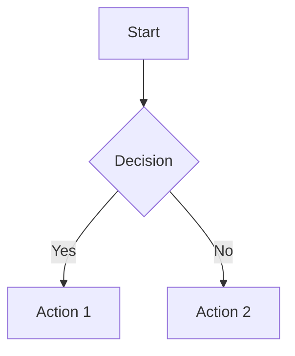

# Markdown Studio

[](https://deepwiki.com/theoklitosBam7/markdown-studio)

A beautiful, modern Markdown editor with live preview, Mermaid diagram support, and a clean writing experience. Available as both a web app and a desktop application.

## What is Markdown Studio?

Markdown Studio is a split-pane Markdown editor that lets you write on one side and see the rendered result instantly on the other. It supports the full CommonMark specification plus Mermaid diagrams for flowcharts, sequence diagrams, entity relationships, Gantt charts, and more.

**Key highlights:**

- Clean, distraction-free writing environment
- Real-time preview as you type
- Built-in diagram support via Mermaid
- Dark and light themes
- File management (open, save, save as)
- Example templates to get you started
- Available as a web app or desktop application

## Quick Start

### Run via NPX (No installation required)

```sh
npx markdown-studio@latest
```

With optional flags:

```sh
npx markdown-studio@latest --port 4173
npx markdown-studio@latest --host 127.0.0.1 --no-open
npx markdown-studio@latest --version
```

The launcher serves the production web build over `http://127.0.0.1` and opens your browser automatically. This is the web experience, not the Electron app, so browser file APIs and fallbacks still apply.

**Browser behavior:**

- Chromium browsers can use the File System Access API on `localhost`
- Other browsers fall back to the existing picker and download flows
- The server is local-only by default because it binds to `127.0.0.1`

### Web App (Development)

Visit the app in your browser by running the dev server:

```sh
pnpm install
pnpm dev
```

### Desktop App

Build and run the Electron desktop application:

```sh
# Install dependencies
pnpm install

# Run in development mode
pnpm dev:desktop

# Build for production
pnpm build:desktop

# Create macOS distribution package (unsigned, no auto-publish)
pnpm dist:mac
```

> [!IMPORTANT]
> **⚠️ macOS Security Warning — Action Required**
>
> If macOS says `Markdown Studio.app` is **damaged and can't be opened**, you need to clear the quarantine flag after moving it to `/Applications`:
>
> ```sh
> xattr -cr /Applications/Markdown\ Studio.app
> ```
>
> **Alternative:** Open `System Settings` → `Privacy & Security` and allow the app to run from there.

## Features

### For Writers

- **Split-pane editor** — Write on the left, preview on the right
- **View modes** — Toggle between split view, editor-only, or preview-only modes
- **Live Markdown rendering** — See changes instantly as you type
- **Mermaid diagram support** — Create flowcharts, sequence diagrams, ER diagrams, and Gantt charts using simple text syntax
- **Theme switching** — Toggle between light and dark modes with smooth animated transitions
- **Document statistics** — Track word, character, line, and diagram counts in real-time
- **Example documents** — Load pre-made templates to learn Markdown or Mermaid syntax
- **Copy to clipboard** — Quickly copy your Markdown source with visual feedback

### For Developers

- **Safe HTML rendering** — Content is sanitized with DOMPurify
- **File System Access API** — Open and save files directly in supported browsers
- **Desktop file operations** — Full file management in the Electron app
- **Responsive design** — Works on desktop and mobile devices
- **Keyboard shortcuts** — Efficient editing with familiar shortcuts
- **Scroll synchronization** — Source map tracking enables editor-preview sync

## Usage

### Writing Markdown

Simply start typing in the editor pane. The preview pane updates automatically as you write.

### Switching View Modes

Click the view toggle buttons to switch between:

- **Editor** — Write without distractions
- **Split** — Side-by-side editing and preview (default)
- **Preview** — Focus on the rendered output

The editor automatically adapts to your preferred layout.

### Creating Diagrams

Use Mermaid syntax within fenced code blocks:

````markdown

````

Supported diagram types include:

- Flowcharts
- Sequence diagrams
- Entity relationship diagrams
- Gantt charts
- And more

### Switching Themes

Click the theme toggle button in the toolbar to switch between light and dark modes. The transition includes a smooth circular reveal animation that emanates from the toggle button.

### Loading Examples

Click the "Examples" button in the toolbar to browse and load pre-made templates. Choose from:

- **Flowchart diagram** — Git feature branch workflow
- **Sequence diagram** — JWT authentication flow
- **Entity relationship diagram** — Blog platform database schema
- **Gantt chart** — Product launch timeline
- **Full kitchen-sink** — Complete Markdown feature demonstration

The kitchen-sink example loads by default on first visit.

### File Operations

**Desktop App:**

- **Open** — Load existing `.md` files via native dialogs
- **Save** — Save your current document
- **Save As** — Save with a new name or location
- **Clear** — Start fresh with an empty editor

**Web App:**

- **Open** — Load `.md` files using the File System Access API (Chrome/Edge) or file picker
- **Save** — Save to previously opened file, or download if using the fallback
- **Save As** — Save with a new name (uses File System Access API when available, otherwise downloads)

## Development

### Project Structure

```
apps/
├── web/                   # Browser app workspace
│   ├── src/main.ts        # Web entry point
│   └── vite.config.ts     # Web Vite configuration
├── desktop/               # Electron desktop workspace
│   ├── src/main.ts        # Desktop renderer entry point
│   ├── electron/          # Electron main process code
│   │   ├── ipc/           # IPC handlers for documents and shell
│   │   ├── menu/          # Application menu configuration
│   │   ├── main.ts        # Electron entry point
│   │   └── preload.ts     # Preload script for secure IPC
│   └── electron.vite.config.ts
└── landing-page/          # Marketing site workspace

packages/app/              # Shared Vue application package
├── src/
│   ├── features/markdown/
│   │   ├── components/    # UI components (EditorPane, PreviewPane, Toolbar, etc.)
│   │   ├── composables/   # Business logic (useMarkdownEditor, useDocumentSession, useDocumentActions)
│   │   └── types/         # TypeScript types for the markdown feature
│   ├── components/        # Shared UI components (ThemeToggle, ViewToggle, Modal, ToolbarButton)
│   ├── composables/       # Shared composables (useTheme, useThemeTransition, useDesktop)
│   ├── router/            # Vue Router configuration
│   ├── utils/             # Utility functions (escapeHtml, platform detection)
│   ├── App.vue            # Root component
│   └── createMarkdownStudioApp.ts

packages/desktop-contract/ # Shared desktop channel/types/validation contract
packages/cli/              # NPX launcher package
├── src/                   # CLI source code
├── public/                # Packaged web assets
└── dist/                  # Built CLI output
```

### Tech Stack

- **Vue 3** — Progressive JavaScript framework with Composition API
- **Vite** — Fast build tool and dev server
- **TypeScript** — Type-safe development
- **Vue Router** — Client-side routing
- **Marked** — Markdown parser and compiler
- **DOMPurify** — HTML sanitization
- **Mermaid** — Diagram generation from text
- **Electron** — Cross-platform desktop app framework
- **electron-vite** — Vite integration for Electron
- **electron-builder** — Packaging and distribution
- **Vitest** — Unit testing framework
- **Cypress** — End-to-end testing
- **ESLint + oxlint** — Linting and code quality
- **oxfmt** — Code formatting

### Available Scripts

```sh
# Development
pnpm dev              # Start Vite dev server
pnpm dev:desktop      # Start Electron in dev mode

# Building
pnpm build            # Type-check and build all buildable workspace apps/packages
pnpm build:npm        # Build and stage the npm launcher package
pnpm build:desktop    # Build Electron bundles
pnpm dist:mac         # Create unsigned macOS package

# Preview
pnpm preview          # Preview production build
pnpm preview:desktop  # Preview Electron build

# Testing
pnpm test:unit        # Run Vitest unit tests
pnpm test:e2e:dev     # Run Cypress in dev mode
pnpm test:e2e         # Run Cypress against production build

# Quality
pnpm type-check       # Run TypeScript type checking
pnpm lint             # Run ESLint and oxlint
pnpm format           # Format code and Markdown with oxfmt
pnpm format:check     # Check formatting without writing changes
```

### Releases

Desktop releases are published through GitHub Actions with the workflow at `.github/workflows/release.yml`.

- Push a tag like `v1.2.3` to build and publish a stable GitHub release
- Push a tag like `v1.2.3-beta.1` to build and publish a prerelease
- Or run the workflow manually with a `version` input

The workflow currently packages the macOS desktop app, uploads the generated `.dmg` and `.zip` assets to the GitHub release, and then opens a pull request to update the workspace package manifests on `main` to match the released version.

### Architecture Highlights

- **Composables-based architecture** — Logic is organized into reusable Vue composables (useTheme, useMarkdownEditor, useDocumentActions, useDocumentSession)
- **Feature-based folder structure** — Related components and logic live together in `packages/app/src/features/`
- **Desktop/web abstraction** — Clean separation between web and Electron APIs via useDesktop composable
- **Source map tracking** — Line-level mapping enables scroll synchronization between editor and preview
- **Theme transition system** — Smooth animated theme switches with useThemeTransition

## Browser Support

Markdown Studio works in all modern browsers that support:

- ES2020+
- CSS Grid and Flexbox
- CSS Custom Properties
- Clipboard API

## License

MIT
