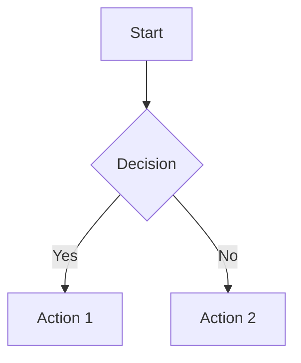

# Markdown Studio

[](https://deepwiki.com/theoklitosBam7/markdown-studio)

A beautiful, modern Markdown editor with live preview, Mermaid diagram support, and a clean writing experience. Available as both a web app and a desktop application.

## What is Markdown Studio?

Markdown Studio is a split-pane Markdown editor that lets you write on one side and see the rendered result instantly on the other. It supports the full CommonMark specification plus Mermaid diagrams for flowcharts, sequence diagrams, entity relationships, Gantt charts, and more.

**Key highlights:**

- Clean, distraction-free writing environment
- Real-time preview as you type
- Built-in diagram support via Mermaid
- Dark and light themes
- File management (open, save, save as)
- Example templates to get you started
- Available as a web app, desktop application, or installable PWA

## Quick Start

### Web App (Recommended)

Use Markdown Studio instantly in your browser at **https://pwa.markdownstudio.eu/**

Features at a glance:

- **Live preview** — See your rendered Markdown as you type
- **Mermaid diagrams** — Create flowcharts, sequence diagrams, and more
- **PWA install** — Install as a standalone desktop app for offline use
- **Auto-save** — Drafts persist automatically between sessions

### Install as PWA

Install Markdown Studio as a standalone desktop app:

1. Visit https://pwa.markdownstudio.eu/ in Chrome, Edge, or Safari
2. Click the **Install** button in the toolbar or use your browser's install option (look for the install icon in the address bar)
3. Launch from your desktop or Start menu — it works offline

**PWA features:**

- **Offline support** — Service worker caches the app for use without internet
- **Auto-save drafts** — Unsaved work persists to browser storage
- **Automatic updates** — New versions deploy automatically; a banner notifies you when an update is available
- **Native feel** — Runs in its own window, separate from the browser

### Run Locally via NPX (Offline option)

For local-only use without internet:

```sh
npx markdown-studio@latest
```

This serves the web build locally and opens your browser. The launcher is useful when you want a fully offline-capable instance without relying on the hosted URL.

Optional flags:

```sh
npx markdown-studio@latest --port 4173
npx markdown-studio@latest --host 127.0.0.1 --no-open
npx markdown-studio@latest --version
```

**Browser behavior:**

- Chromium browsers can use the File System Access API on `localhost`
- Other browsers fall back to the existing picker and download flows
- The server binds to `127.0.0.1` by default for security

### Download Desktop App

Get the native macOS application from GitHub Releases:

**[Download latest release →](https://github.com/theoklitosBam7/markdown-studio/releases/latest)**

Download `Markdown-Studio-darwin-arm64.dmg` (Apple Silicon), open the DMG, and drag the app to your `/Applications` folder.

> [!IMPORTANT]
> **macOS Security Warning — Action Required**
>
> macOS may show a warning that `Markdown Studio.app` is **damaged and can't be opened**. This happens because the app is unsigned.
>
> **Fix:** Clear the quarantine flag in Terminal:
>
> ```sh
> xattr -cr /Applications/Markdown\ Studio.app
> ```
>
> **Alternative:** Open `System Settings` → `Privacy & Security` and allow the app to run from there.

### Development

Build and run the app locally from source:

**Web app:**

```sh
pnpm install
pnpm dev
```

**Desktop app:**

```sh
pnpm install
pnpm dev:desktop    # Development mode
pnpm build:desktop # Production build
pnpm dist:mac      # Create macOS distribution package (unsigned)
```

## Features

### For Writers

- **Split-pane editor** — Write on the left, preview on the right
- **View modes** — Toggle between split view, editor-only, or preview-only modes
- **Live Markdown rendering** — See changes instantly as you type
- **Mermaid diagram support** — Create flowcharts, sequence diagrams, ER diagrams, and Gantt charts using simple text syntax
- **Theme switching** — Toggle between light and dark modes with smooth animated transitions
- **Document statistics** — Track word, character, line, and diagram counts in real-time
- **Example documents** — Load pre-made templates to learn Markdown or Mermaid syntax
- **Copy to clipboard** — Quickly copy your Markdown source with visual feedback
- **PWA install support** — Install as a standalone desktop-like app from supported browsers
- **Auto-save drafts** — Web app automatically persists unsaved work to localStorage
- **Offline ready** — Service worker caching enables continued use without an internet connection

### For Developers

- **Safe HTML rendering** — Content is sanitized with DOMPurify
- **File System Access API** — Open and save files directly in supported browsers
- **Desktop file operations** — Full file management in the Electron app
- **Responsive design** — Works on desktop and mobile devices
- **Keyboard shortcuts** — Efficient editing with familiar shortcuts
- **Scroll synchronization** — Source map tracking enables editor-preview sync
- **Service worker** — Offline caching and automatic update detection in the web app

## Usage

### Writing Markdown

Simply start typing in the editor pane. The preview pane updates automatically as you write.

### Switching View Modes

Click the view toggle buttons to switch between:

- **Editor** — Write without distractions
- **Split** — Side-by-side editing and preview (default)
- **Preview** — Focus on the rendered output

The editor automatically adapts to your preferred layout.

### Creating Diagrams

Use Mermaid syntax within fenced code blocks:

````markdown

````

Supported diagram types include:

- Flowcharts
- Sequence diagrams
- Entity relationship diagrams
- Gantt charts
- And more

### Switching Themes

Click the theme toggle button in the toolbar to switch between light and dark modes. The transition includes a smooth circular reveal animation that emanates from the toggle button.

### Loading Examples

Click the "Examples" button in the toolbar to browse and load pre-made templates. Choose from:

- **Flowchart diagram** — Git feature branch workflow
- **Sequence diagram** — JWT authentication flow
- **Entity relationship diagram** — Blog platform database schema
- **Gantt chart** — Product launch timeline
- **Full kitchen-sink** — Complete Markdown feature demonstration

The kitchen-sink example loads by default on first visit.

### File Operations

**Desktop App:**

- **Open** — Load existing `.md` files via native dialogs
- **Save** — Save your current document
- **Save As** — Save with a new name or location
- **Clear** — Start fresh with an empty editor

**Web App:**

- **Open** — Load `.md` files using the File System Access API (Chrome/Edge) or file picker
- **Save** — Save to previously opened file, or download if using the fallback
- **Save As** — Save with a new name (uses File System Access API when available, otherwise downloads)

## Development

### Project Structure

```
apps/
├── web/                   # Browser app workspace
│   ├── src/main.ts        # Web entry point
│   └── vite.config.ts     # Web Vite configuration
├── desktop/               # Electron desktop workspace
│   ├── src/main.ts        # Desktop renderer entry point
│   ├── electron/          # Electron main process code
│   │   ├── ipc/           # IPC handlers for documents and shell
│   │   ├── menu/          # Application menu configuration
│   │   ├── main.ts        # Electron entry point
│   │   └── preload.ts     # Preload script for secure IPC
│   └── electron.vite.config.ts
└── landing-page/          # Marketing site workspace

packages/app/              # Shared Vue application package
├── src/
│   ├── features/markdown/
│   │   ├── components/    # UI components (EditorPane, PreviewPane, Toolbar, etc.)
│   │   ├── composables/   # Business logic (useMarkdownEditor, useDocumentSession, useDocumentActions)
│   │   └── types/         # TypeScript types for the markdown feature
│   ├── components/        # Shared UI components (ThemeToggle, ViewToggle, Modal, ToolbarButton)
│   ├── composables/       # Shared composables (useTheme, useThemeTransition, useDesktop)
│   ├── router/            # Vue Router configuration
│   ├── utils/             # Utility functions (escapeHtml, platform detection)
│   ├── App.vue            # Root component
│   └── createMarkdownStudioApp.ts

packages/desktop-contract/ # Shared desktop channel/types/validation contract
packages/cli/              # NPX launcher package
├── src/                   # CLI source code
├── public/                # Packaged web assets
└── dist/                  # Built CLI output
```

### Tech Stack

- **Vue 3** — Progressive JavaScript framework with Composition API
- **Vite** — Fast build tool and dev server
- **TypeScript** — Type-safe development
- **Vue Router** — Client-side routing
- **Marked** — Markdown parser and compiler
- **DOMPurify** — HTML sanitization
- **Mermaid** — Diagram generation from text
- **Electron** — Cross-platform desktop app framework
- **electron-vite** — Vite integration for Electron
- **electron-builder** — Packaging and distribution
- **Vitest** — Unit testing framework
- **Cypress** — End-to-end testing
- **ESLint + oxlint** — Linting and code quality
- **oxfmt** — Code formatting

### Available Scripts

```sh
# Development
pnpm dev              # Start Vite dev server
pnpm dev:desktop      # Start Electron in dev mode

# Building
pnpm build            # Type-check and build all buildable workspace apps/packages
pnpm build:npm        # Build and stage the npm launcher package
pnpm build:desktop    # Build Electron bundles
pnpm dist:mac         # Create unsigned macOS package

# Preview
pnpm preview          # Preview production build
pnpm preview:desktop  # Preview Electron build

# Testing
pnpm test:unit        # Run Vitest unit tests
pnpm test:e2e:dev     # Run Cypress in dev mode
pnpm test:e2e         # Run Cypress against production build

# Quality
pnpm type-check       # Run TypeScript type checking
pnpm lint             # Run ESLint and oxlint
pnpm format           # Format code and Markdown with oxfmt
pnpm format:check     # Check formatting without writing changes
```

### Releases

Release intent is tracked with Changesets, and only the shipped artifacts carry release versions:

- `@markdown-studio/desktop` for the macOS desktop app
- `markdown-studio` for the published npm package

Internal workspaces such as `@markdown-studio/app`, `@markdown-studio/web`, `@markdown-studio/desktop-contract`, and `@markdown-studio/landing` are implementation details and stay on `0.0.0`.

Maintainer flow:

1. Add a changeset in the pull request when the change affects a shipped artifact.
2. Merge the pull request to `main`.
3. GitHub Actions opens or updates a version pull request through `.github/workflows/version-packages.yml`.
4. Merge the version pull request once the release versions and changelog entries look correct.
5. Optionally run `.github/workflows/release-desktop.yml` and/or `.github/workflows/publish-npm.yml` with `dry_run=true` to validate the path without publishing.
6. Run the same workflow with `dry_run=false` from the ref you want to ship.

Scope changesets by user-visible impact:

- Use `@markdown-studio/desktop` for native desktop behavior, packaging, and Electron-only changes.
- Use `markdown-studio` for the browser launcher package and web experience published to npm.
- Use both package names when shared changes affect both shipped artifacts.

Artifact tags are created by the publish workflows:

- Desktop releases use `desktop-v<version>`
- npm publishes use `npm-v<version>`

GitHub Release notes are generated from the artifact changelogs, not from GitHub's default autogenerated notes:

- `desktop-v*` releases use the matching version section from `apps/desktop/CHANGELOG.md`
- `npm-v*` releases use the matching version section from `packages/cli/CHANGELOG.md`
- the generated `Commits by scope` section groups commit subjects into these release-note scopes: `app`, `ci`, `cli`, `desktop`, `electron`, `export`, `landing-page`, and `markdown`
- alias scopes such as `workflows`, `markdown-editor`, and `useDocumentActions` are normalized into the stable buckets above
- `chore(release): ...` commits are intentionally excluded from generated release notes

Prereleases should be prepared through Changesets prerelease mode. The manual publish workflows read the existing manifest versions and publish prereleases to the appropriate channels automatically.

Convenience commands for prerelease mode:

- `pnpm changeset:pre:enter` enters prerelease mode using the `next` tag
- `pnpm changeset:pre:exit` exits prerelease mode and returns future version PRs to stable releases

Dry-run behavior:

- `release-desktop.yml` still installs dependencies, runs quality checks, builds artifacts, and generates release notes, but skips tag creation and GitHub release publishing
- `publish-npm.yml` still builds, verifies the npm package, and generates release notes, but skips `npm publish`, skips tag creation, and skips GitHub release publishing

### Architecture Highlights

- **Composables-based architecture** — Logic is organized into reusable Vue composables (useTheme, useMarkdownEditor, useDocumentActions, useDocumentSession)
- **Feature-based folder structure** — Related components and logic live together in `packages/app/src/features/`
- **Desktop/web abstraction** — Clean separation between web and Electron APIs via useDesktop composable
- **Source map tracking** — Line-level mapping enables scroll synchronization between editor and preview
- **Theme transition system** — Smooth animated theme switches with useThemeTransition

## Browser Support

Markdown Studio works in all modern browsers that support:

- ES2020+
- CSS Grid and Flexbox
- CSS Custom Properties
- Clipboard API

## License

MIT
